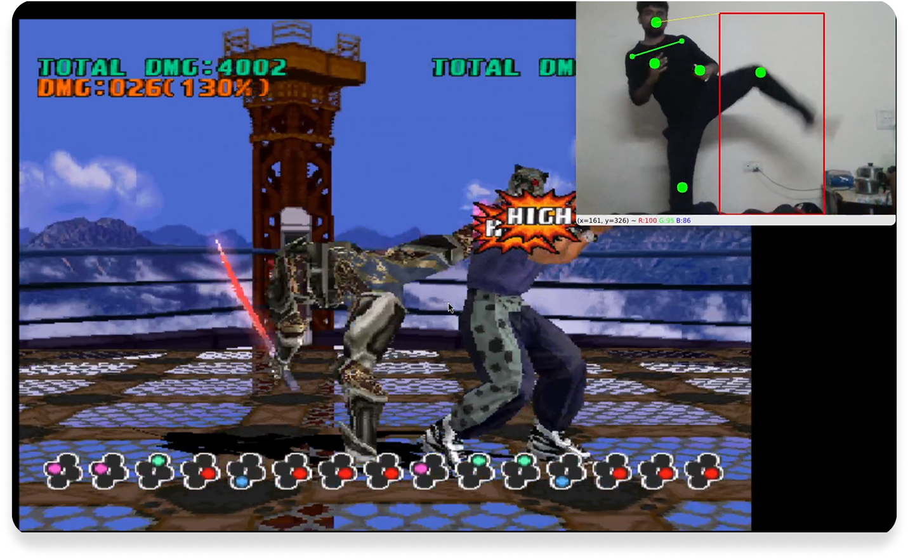

# Gesture Gaming

<p align="center">
  
  
  
  
</p>

Play Tekken through body gestures - a hands-free gaming experience using computer vision

## 📖 Overview

Gesture-Gaming-Tekken is an innovative project that allows you to play Tekken (and potentially other fighting games) using only your body movements captured via webcam. The system provides two different control methods:

1. **Pose Detection System** - Uses MediaPipe's pose detection for full-body skeletal tracking
2. **Motion Tracking System** - Uses OpenCV's CSRT tracker for facial movement tracking



## ✨ Features

- **No additional hardware required** - Just a standard webcam
- **Two control systems** to choose from:
  - **Pose-based control** (full-body skeletal tracking)
  - **Face motion tracking** (tracks face movement for controls)
- **Customizable trigger zones** that move with your face
- **Configurable key mappings** to adapt to different games
- **Intelligent cooldown system** to prevent action spamming
- **Interactive setup process** for easy configuration

## 🚀 Getting Started

### Prerequisites

- Python 3.12 or higher
- Webcam
- Tekken - https://3tekken.com/

### Installation

```bash
# Clone the repository
git clone https://github.com/yourusername/Gesture-Gaming-Tekken.git
cd Gesture-Gaming-Tekken

# Create and activate a virtual environment (recommended)
python -m venv .venv
source .venv/bin/activate  # On Windows: .venv\Scripts\activate

# Install dependencies
pip install -e .
```

## 🎮 Usage

The project offers two different control methods:

### Pose-Based Control System

```bash
python -m pose.pose
```

This system uses MediaPipe to track your full body posture:

- **Movement**: Lean left/right with your shoulders to move your character
- **Actions**: Move your hands or knees into the trigger zone to perform game actions

### Motion Tracking System

```bash
python -m track.tracking
```

This system tracks your face position:

- **Movement**: Move your face left/right/up/down to control your character
- **Actions**: Define motion regions that trigger specific actions when movement is detected

## ⚙️ Configuration

Both control systems have interactive setup processes for first-time users:

- **Pose System Configuration**: Define trigger zones relative to your face position
- **Motion Tracking Configuration**: Define face tracking region and gesture detection zones

You can also customize key mappings in `key_config.json`:

```json
{
  "up": "__special_key__up",
  "down": "__special_key__down",
  "left": "__special_key__left",
  "right": "__special_key__right",
  "punch": "a",
  "kick": "x",
  "kick2": "z",
  "block": "s",
  "grab": "d"
}
```

## 🧠 Technical Architecture

The project follows a modular architecture with clear separation of concerns:

- **Core Module**: Contains shared functionality:
  - `input.py`: Handles keyboard input simulation
  - `settings.py`: Manages configuration loading/saving
- **Pose Module**: Implements the pose-based control system:
  - `pose.py`: Main pose detection and control logic
  - `setup.py`: Interactive configuration for pose system
  - `utils.py`: Helper functions for pose detection
- **Track Module**: Implements the motion tracking system:
  - `tracking.py`: Main face tracking control loop
  - `motion_detector.py`: Motion detection and action triggering
  - `setup.py`: Interactive configuration for tracking system
  - `utils.py`: Helper functions for tracking

## 📊 Performance Considerations

Both systems are optimized for responsive gameplay:

- **Frame rate optimization** to reduce input lag
- **Movement thresholds** to filter out unintentional movements
- **Cooldown timers** to prevent action spamming
- **Reference position tracking** to adapt to user movement over time

## 📝 License

This project is licensed under the MIT License - see the LICENSE file for details.

## 🙏 Acknowledgements

- [OpenCV](https://opencv.org/) for computer vision capabilities
- [MediaPipe](https://mediapipe.dev/) for pose detection
- [PyInput](https://github.com/moses-palmer/pynput) for input simulation
- [Imutils](https://github.com/PyImageSearch/imutils) for image processing utilities
